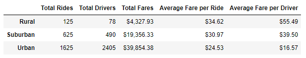
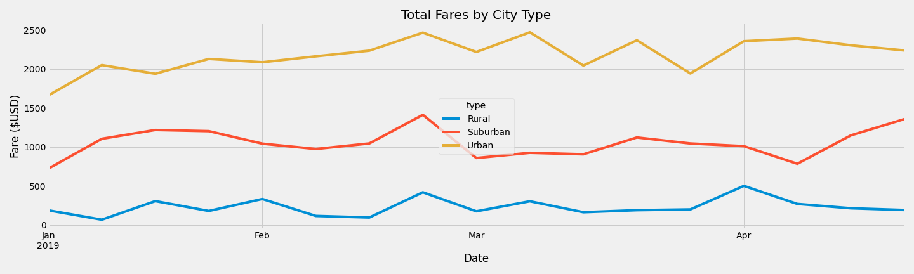

# PyBer Rideshare Analysis

## Overview
The purpose of this analysis is to learn more about the differences in ride counts, fares, and driver counts between urban, suburban and rural cities.

## Resources
- Source Data:  [city_data.csv](./Resources/city_data.csv)
- Source Data:  [ride_data.csv](./Resources/ride_data.csv)
- Analysis Notebook:  [PyBer_Challenge.ipynb](./PyBer_Challenge.ipynb)
- Tools Used:  Python 3.7 incl. pandas and matplotlib, Anaconda 4.10, Jupyter Notebook 6.3

## Results

A summary of key metrics by city type is shown below.  A few notable differences between city types are:
- There are 15x more Urban and 5x more Suburban rides than Rural
- There are 30x more Urban and 6x more Suburban drivers than Rural
- Total fares for Urban cities are about 10x higher than Rural; Suburban city totals are about 5x higher than Rural
- The average fare per ride for Rural trips about 40% higher than Urban trips and 12% higher than suburban trips
- The average fare per driver data is likely inaccurate, see note below

A key concern with this data set is that it shows a higher driver count than ride count for urban cities, which may indicate that there are a number of inactive drivers being counted.  Because of this, the Average Fare per Driver calculation is inconclusive for active drivers, and likely understated from the actual average fare an active driver receives.  Therefore, the Average Fare per Driver data should not be used for decision making.

 

The total fares by week for each city type for January through April 2019 are shown in the line graph below.  Weekly fares are generally flat for all city, fluctuating within a $500 band.
 

## Summary and Recommendations
Based on the results above, the following actions can be considered to address the disparities between city type:
- Reduce the price per mile for Rural cities or increase the price per mile in Urban cities.  This assumes that the higher average fare in Rural areas is driven by longer trips, such as a drive from a small town into the closest city.
- Offer incentives to add drivers in Rural and Suburban cities; specifically offer incentives during times of the day or week when drivers are frequently unavailable.
- Offer incentives for drivers and riders to use the system during local festivals, particularly in rural areas where these are common.

Additional analysis that could be performed to improve confidence in the results and recommendations includes:
- Average distance per ride could be used to determine if reducing the cost per mile will improve rural ridership
- Calculate average fare per driver based on active drivers rather than the total number of registered drivers
- Average wait times for a driver to arrive and number of times a rider is not able to be matched to a driver. This would help determine if adding drivers in Rural and Suburban cities would increase ridership.